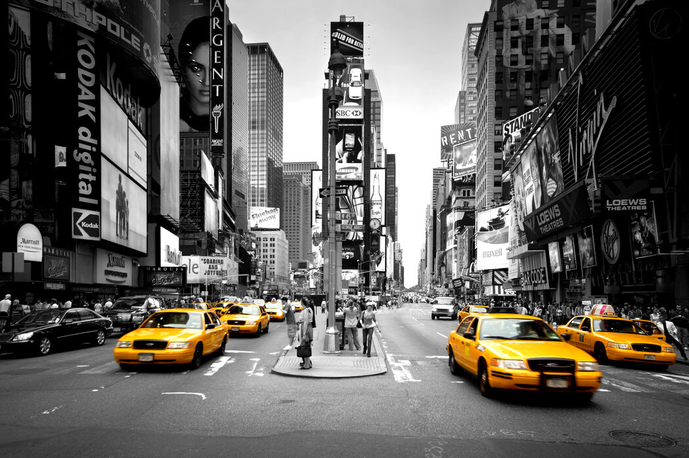
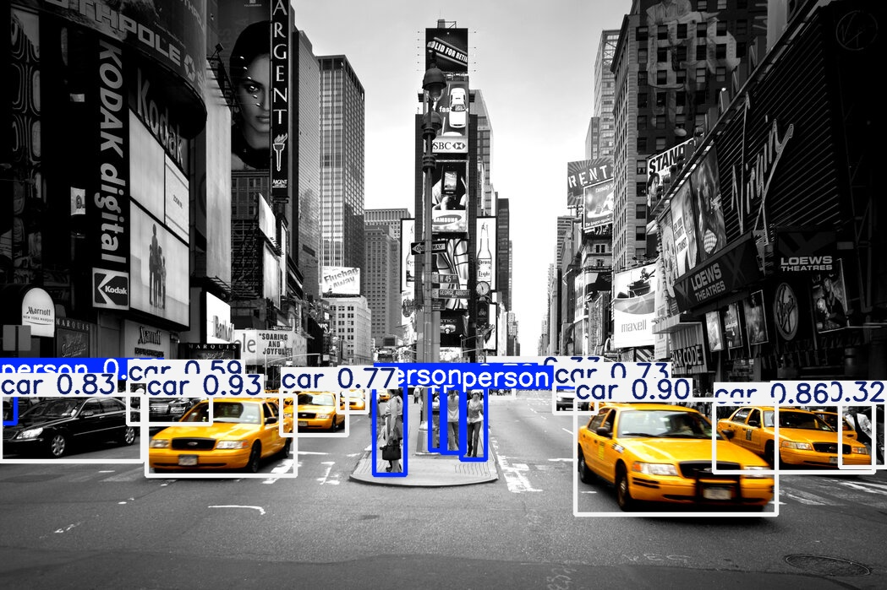

# YOLOv8 Object Detection App

A Python web app that performs object detection on videos using the state-of-the-art YOLOv8 models from Ultralytics. Upload any video, choose a YOLOv8 model variant, adjust detection thresholds, and get a processed video with bounding boxes around detected objects — all through an interactive Gradio interface.

---

## Features

- Supports YOLOv8 models: `yolov8n`, `yolov8s`, `yolov8m`, `yolov8l`, `yolov8x`  
- Adjustable confidence and IoU thresholds  
- Process every Nth frame to speed up inference  
- Outputs a video with bounding boxes and class labels  
- Displays a summary table of detected objects with counts  
- Example videos included for quick testing  

---

## Demo

You can run the app locally or deploy it on a server. Once running, upload a video or select an example, adjust parameters, and press **Submit**.

**Example output:**

| Input Video Frame                | Output Video Frame with Detections  |
|----------------------------------|-------------------------------------|
|  |  |

*(These are sample frames extracted from demo videos)*

---

### Requirements

- Python 3.8 or above  
- [Ultralytics YOLO](https://github.com/ultralytics/ultralytics)  
- OpenCV  
- Gradio  
- NumPy  
- uuid  

### Install dependencies

```bash
pip install ultralytics opencv-python gradio numpy
